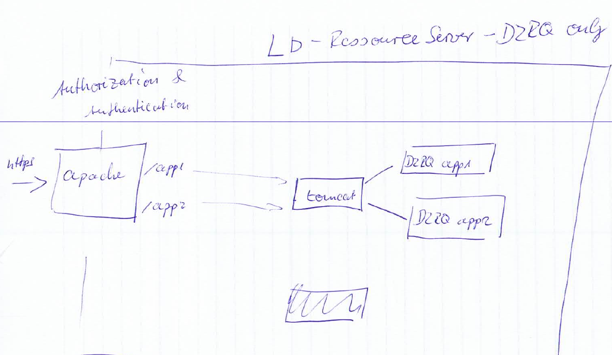
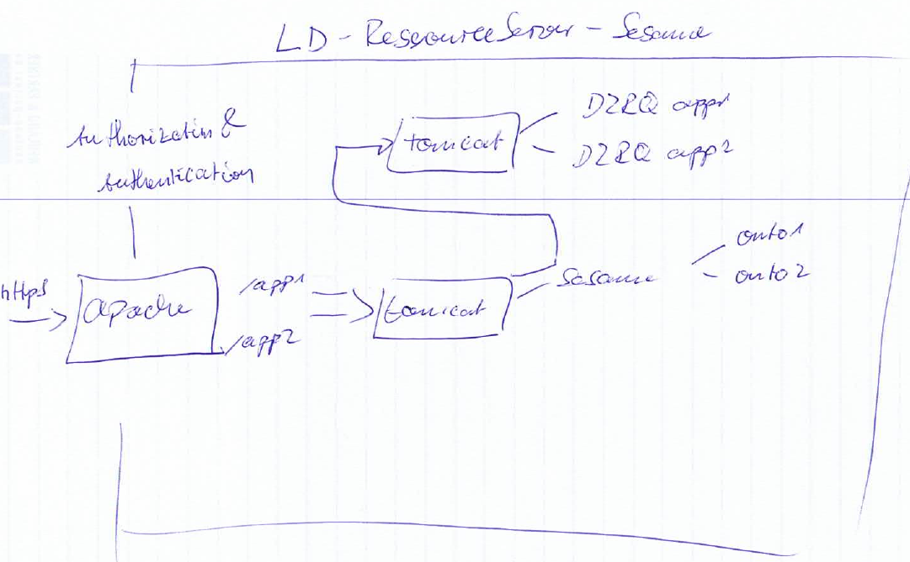

# Publishing multiple Relational Databases
##Simple version using only apache & d2rq

Thougts:
* simple solution, uses only few different software modules.
* only limited vocabulary serving possible
* authentication & authorization 
  * apache is providing auth & autz.
  * basic auth is used, so clients has to support this also.
  * is url pattern based

## More complex using Sesame as repo manager

Thougts:
* one more component is used.
* sesame repo has to be secured
	* Important Security Consideration: Workbench stores user name and password credentials in plain-text cookies in the browser. You will need to configure your Workbench server for HTTPS to properly protect these credentials. 
	* See <https://tomcat.apache.org/tomcat-6.0-doc/ssl-howto.html> or 
	* <https://tomcat.apache.org/tomcat-7.0-doc/ssl-howto.html> for more information.	
* vocabulary serving works better
* authentication & authorization 
  * apache is providing auth & autz.
  	* see 
* <http://www.rivuli-development.com/further-reading/sesame-cookbook/basic-security-with-http-authentication/>
  * basic auth is used, so clients has to support this also.
  * is url pattern based
