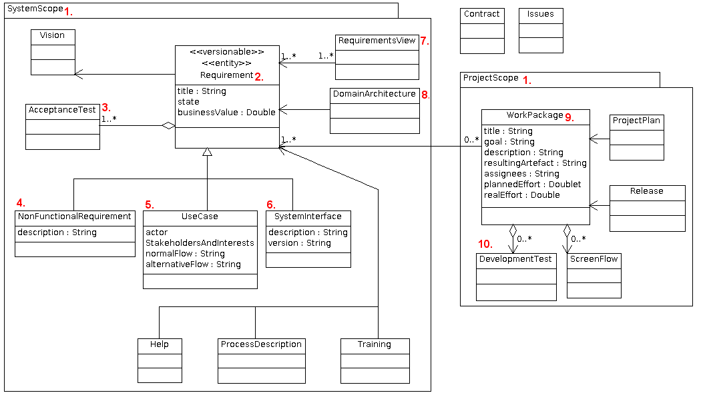

## Struktur und Referenzierung von Anforderungen
Die strukturellen Lösungselemente für die beschriebene Kosten / Nutzen Herausforderung finden Sie im folgenden Schaubild:

###System vs. Projekt
Die Lebensbereiche  eines Systems (1) unterscheiden sich selbstverständlich vom Lebensbereich eines Projekts (1). Ein System wird typischerweise von mehreren Umsetzungs-Projekten erstellt, gepflegt oder geändert.
Warum ich das hier dennoch explizit erwähne? Der ein oder andere hat meiner Erfahrung nach diese Trennlinie gedanklich noch nicht bemerkt.
