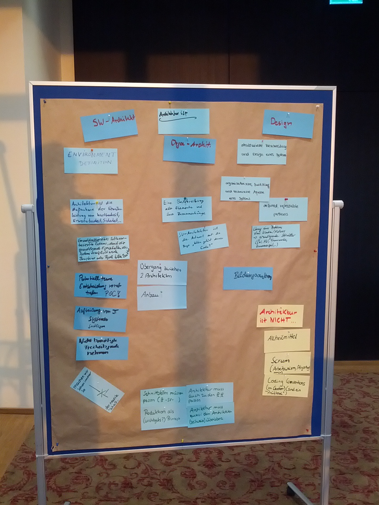

# Analysis: Definition of Words around Architecture

What's the definition of IT-Architecture?
  
* Architecture can be divided into
  * Hardware Architecture
  * Software Architecture
  * Operations Architecture
  * Solution Architecture
* What's architecture against Design?

## Workshop Results
