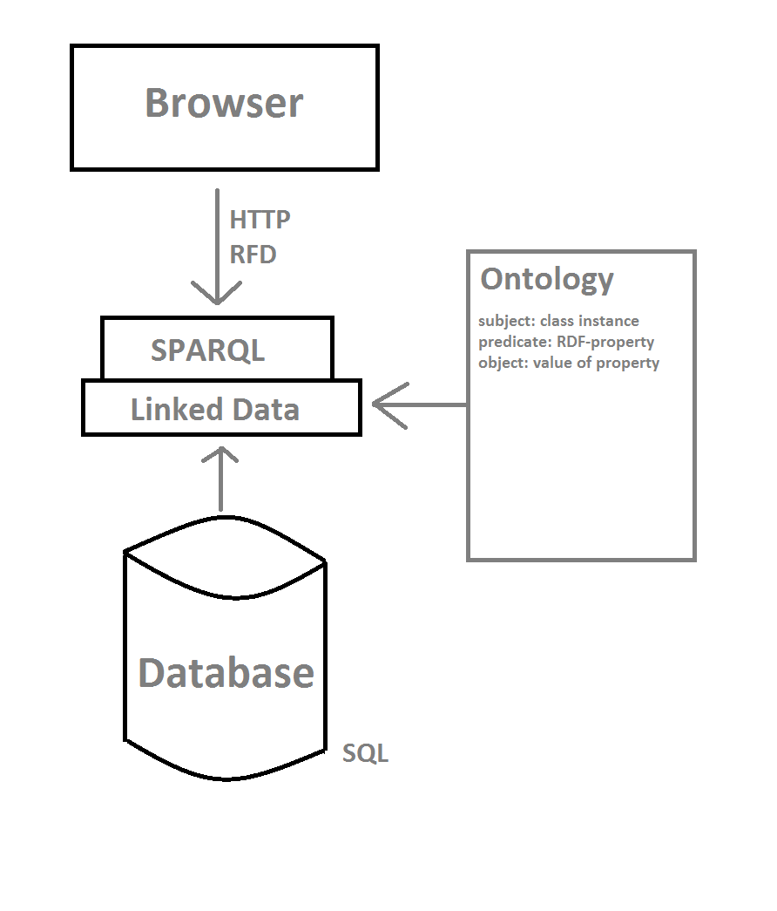

# Analysis

## Overview and Basics

### Process
* HTTP-request from Browser
* asks for RDF 
* RDF: model for subject–predicate–object expressions
* D2RQ-Server responses 
* linked data is displayed

### Development Procedure:
* Assuming a running server (e.g. localhost) with D2RQ-Server
* Setup underlying Database
* Create full Mapping
* Reduce Mapping (when necessary): Extract relevant data
* Start D2RQ-Server with Mapping

## Tools
* Project: http://d2rq.org/
* Code: https://github.com/d2rq/d2rq
* Path on Server: /var/lib/d2rq-0.8.1

## Idea: Multi-Source Ability
* Establish a multi-source ability by deploying .war-files into a servlet container (e.g. tomcat), running on a server
* use a distinct .war-file for every business application
* thus, databases that do not belong together stay separated
* when accessing the the server, the client application can be accessed by the URL which contains the name of the .war-file
* thus, the URLs define namespaces for different business applications

## Solution

### Setup DB
e.g. for sql dump file named "output2.sql" with [username], [userPassword] and [dbName] for D2RQ on [server]

* mysql -hlocalhost -uroot -prootpwd -e "CREATE USER '[username]'@'localhost' IDENTIFIED BY '[userPassword]'";
* mysql -hlocalhost -uroot -prootpwd -e "CREATE DATABASE IF NOT EXISTS [dbName]";
* mysql -hlocalhost -uroot -prootpwd -e "GRANT ALL ON [dbName].* TO '[username]'@'localhost'";
* mysql -hlocalhost -uroot -prootpwd -e "FLUSH PRIVILEGES";
* mysql -hlocalhost -u[username] -[userPassword] [dbName] < output2.sql
 

### Generate full Mapping
* ./generate-mapping -u [username] -p [userPassword] -o mapping_[dbName]_full.ttl jdbc:mysql://127.0.0.1:3306/[dbName]

### Adapt full Mapping
* vi mapping_[dbName]_full.ttl
* extract necessary fields
* make sure to delete fields relevant to security (plain passwords, security questions, etc.)

* subject: instance of a class
* predicate: RDF property 
* object: value of RDF property

### Start Server with Jetty
* ./d2r-server -b http://[server]:2020/ mapping_[dbName]_full.ttl

## What happens behind the scenes?

  
 

