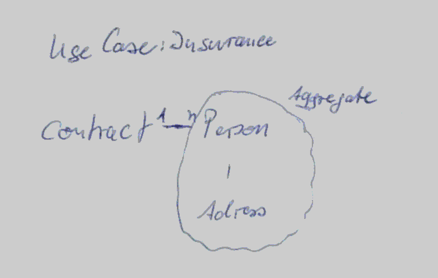
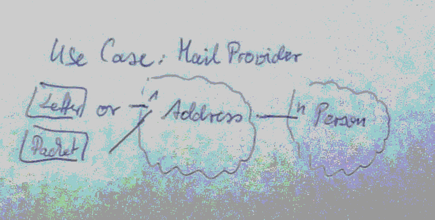

# Comparison between ScopeConcepts

## UseCase
Scopes are quite important for determine the range for different kind of operations:
* __Persistence__: Scopes can be used to determine the range for crud operations. Having a clear understanding of persistence function scopes is often a precondition for solving performance issues.
* __Domain Functions__: Same as persistence functions, scopes can also determine the range for domain operations. 
* __Validation__: Validation is a specific kind of domain function. Having a clear understanding of scope context is often helpful for the decision where to anchor a specific validation or when to execute.

## Scope in different IT-Contexts

I distinguish between the following scopes

| MyScopeName 	| Application UI		| ER Model 			| UML / ObjectOriented 	| LinkedData |
| ------------- | --------------------  | ----------------- | ---------------------	| ---------- |
|FieldLevel		|input element			|column				|field in class			|property	|
|ObjectLevel	|group of input elements|maybe table?		|class					|class		|
|AggregateLevel	|the whole page or screen|tables connected by foreign key|classes connected by aggregate associations|maybe shape namespaces?|
|ApplicationGlobalLevel|the whole application|database / e.g. unique constraints|maybe package / deployable|ontology representing applications domain context|
|WorldLevel|there is no representation, the typical problem arises on application integrations|no representation|no representation|the whole linked data world ;-)|

## Some Thougts about Scopes
Lets think about the information Address is used in several contexts.
    
### Example Word Serial Letter

We want to send one Letter to several addressees. So it's sufficient to model the address here as simple string (okay, let's say the string may containing newlines ;).

### Example Insurance

For insurances it's primary important who is the contractor and how the insurance may contact him. So here it's possible, to talk about persons in first order and aggregate addresses to each person. Address without person will not be necessary.  

### Example MailProvider

For MailProviders the primary object of interest is probably the address, where goods like letters or packets should be delivered to. Sometimes it may be necessary, to know, which person lives at an address, in case the post officer needs a receipt.

### Scopes are ContextSensitive
All these scope decisions depends on the context of the informations usage. Therefore all models need the association to their usage context in order to be relevant.

###The specific Relevance of AggregateLevel
Scopes like FieldLevel, ObjectLevel or ApplicationLevel are well known and widly used in IT. But in my experience the gap between Object- and Application Level leaves a large gap of ambiguousity. Therefore the AggregateLevel introduced by Eric Evans in his Domain Driven Design fits nice in this gap.
The AggregateLevel helps to clearly divide the domain in an consistent manner and therefore the AggregateLevel is the starting point, for finding a good domain architecture.   