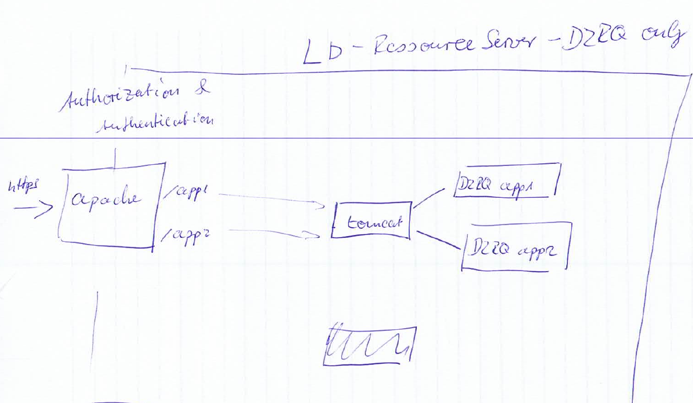
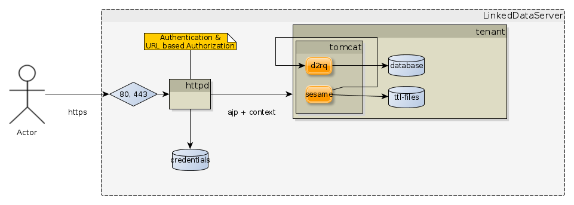

# Publishing multiple Relational Databases

## Idea: Multi-Source Ability
* Establish a multi-source ability by deploying .war-files into a servlet container (e.g. tomcat), running on a server
* use a distinct .war-file for every business application
* thus, databases that do not belong together stay separated
* when accessing the the server, the client application can be accessed by the URL which contains the name of the .war-file
* thus, the URLs define namespaces for different business applications

##Simple version using only apache & d2rq

Thougts:
* simple solution, uses only few different software modules.
* only limited vocabulary serving possible
* authentication & authorization 
  * apache is providing auth & autz.
  * basic auth is used, so clients has to support this also.
  * is url pattern based

## More complex using Sesame as repo manager

### Infrastructure
1. The httpd terminates ssl, only ports 80 / 443 are accepted.

### Authentication & Autorization
1. Basic Authentication is used for authentication.
2. Access Authorization is used for authorizing tenants.
  a. Authoritzation is done by filtering url patterns.
  b. By filtering url patterns, sparql will not be protected. Therefore different tenant repositories will be completly seperated on app-server level.
3. Distinguished roles are
  a. public
  b. protected
  
### URLs
1. Each tenant has its own url context: https://[servername]/tenant/...

### LD Publishing
1. Todo: can sesame publish with custom url context?
2. Todo: can d2rq be published by sesame?
 

### Further Thougts:
* one more component is used.
* sesame repo has to be secured
	* Important Security Consideration: Workbench stores user name and password credentials in plain-text cookies in the browser. You will need to configure your Workbench server for HTTPS to properly protect these credentials. 
	* See <https://tomcat.apache.org/tomcat-6.0-doc/ssl-howto.html> or 
	* <https://tomcat.apache.org/tomcat-7.0-doc/ssl-howto.html> for more information.	
* vocabulary serving works better
* authentication & authorization 
  * apache is providing auth & autz.
  	* see 
* <http://www.rivuli-development.com/further-reading/sesame-cookbook/basic-security-with-http-authentication/>
  * basic auth is used, so clients has to support this also.
  * is url pattern based
