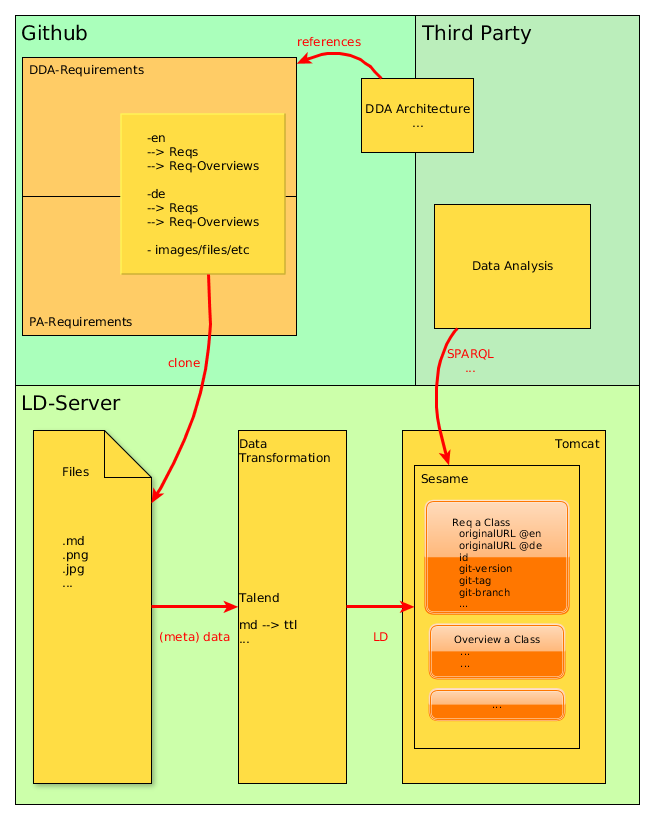

# Publishing Requirements as Linked Data

Our requirements, which are published and referenced on/by gitbook, are lying on github. 
Several requirements exist in different languages (en, de) sharing the same requirement-id. In order to provide the requirements as linked data, the LD-Server clones the requirements repositories into another repository, located locally on the LD-Server. This data mainly consists of .md files, but it may also contain images, documents, etc.
The data then is processed by data-pipes, defined with [Talend](http://www.talend.com/products/talend-open-studio), creating an ontology. 
For every requirement, an instance is created. The idea is, that requirements that are available in different languages are represented in a single requirement instance. This instance holds the original URLs for both languages. 
The [Sesame](http://rdf4j.org/) module on the LD-Server then provides an interface to access the ontologies and its instances.