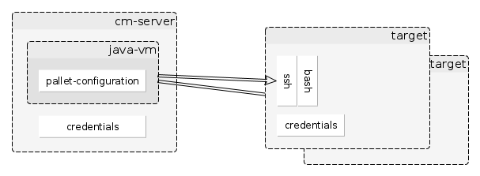
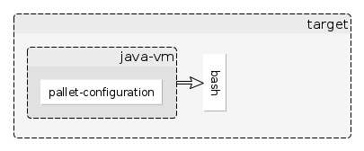

###Distribution
Configuration can be distributed in push mode and pull mode.
* Push is important for security reason (server-credentials may not reside on every server node in net)
* Pull is important for social & technical reasons.
  * Technical: Some networks may be not accessible from outside.
  * Social: Developers don't like uncontrolled updates from outside.
  

