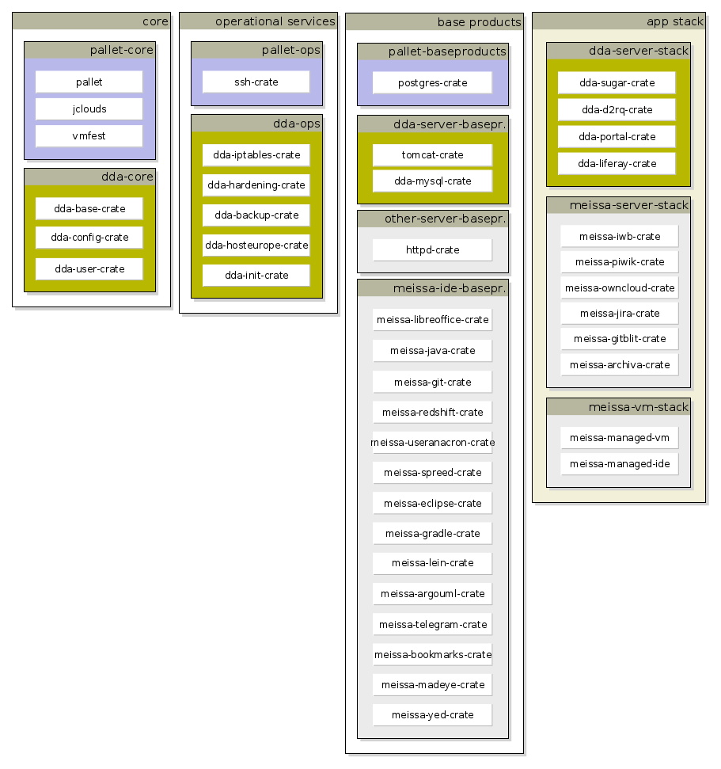

#Modules and building blocks

There are many crates in the pallet world. In order to get a better overview, we will group these crates into the following groups:

* **core**: There is the pallet-core at the one hand and the pallet-dda-core on the other hand. pallet-dda-core enhances the pure pallet core. Examples of core crates are: Pallet itself, the pallet crate foundation, the dda-configuration-crate or the dda-crate-extension.
* **middleware**: middleware-crates are usefull grate for fundamental functions like user handling, ssh handling, git handling. Also crosscutting aspects like backup, monitoring or security are residing in middleware-crate group.
* **app-stack**: app-stack-crates represents the different application stacks, combining all the middleware in order to provide functionality to users. 
