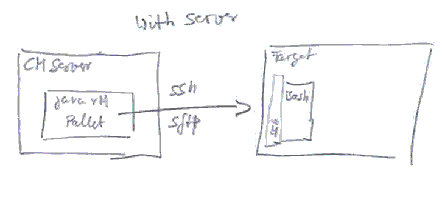
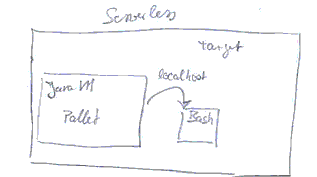

#Architecture

* TODO Considere Dimensions
  * tenants, 
  * different system environments like dev, test, staging, integration or production 
  * cross cutting functions like security, backup, users identity on various levels

##Modules and building blocks

There are many crates in the pallet world. In order to get a better overview, we will group these crates into the following groups:
* core: There is the pallet-core at the one hand and the pallet-dda-core on the other hand. pallet-dda-core enhances the pure pallet core. Examples of core crates are: Pallet itself, the pallet crate foundation, the dda-configuration-crate or the dda-crate-extension.
* middleware: middleware-crates are usefull grate for fundamental functions like user handling, ssh handling, git handling. Also crosscutting aspects like backup, monitoring or security are residing in middleware-crate group.
* app-stack: app-stack-crates represents the different application stacks, combining all the middleware in order to provide functionality to users. 

##Phases
* bootstrap: Bootstrap is a pallet convention. In this pahse new vm's are provisioned.
* init: Init is a dda convention. Init configures already existing nodes for the use with pallet.  
* settings: Settings is a pallet convention. The settings phase collects config and other information from crates (and nodes) without providing side effects. So the settings phase does not alter state of servers and nodes. 
* install: Install is a dda convention. The install phase brings software to nodes. The installation is intended to take effect only once. The state is managed by the dda-config-crate in combination with dda-crate. Functions in install-phase should be able to be called multiple times and support the simulation mode. Install uses the newest available version.
* upgrade: Upgrade is a dda convention. The upgrade phase compares the version installed and the version intended for configuration. If there is a difference, upgrade can apply migration scripts.Functions in upgrade-phase should be able to be called multiple times and support the simulation mode.
* configure: Configure is a pallet convention. Configure brings the newest configuration to the target nodes. Configure is intended to be called on a regular base. Functions in configure-phase should support the simulation mode.

##Simulation Mode
TODO: describe sm.

###Distribution
Configuration can be distributed in push mode and pull mode.
* Push is important for security reason (server-credentials may not reside on every server node in net)
* Pull is important for social & technical reasons.
  * Technical: Some networks may be not accessible from outside.
  * Social: Developers don't like uncontrolled updates from outside.
  

