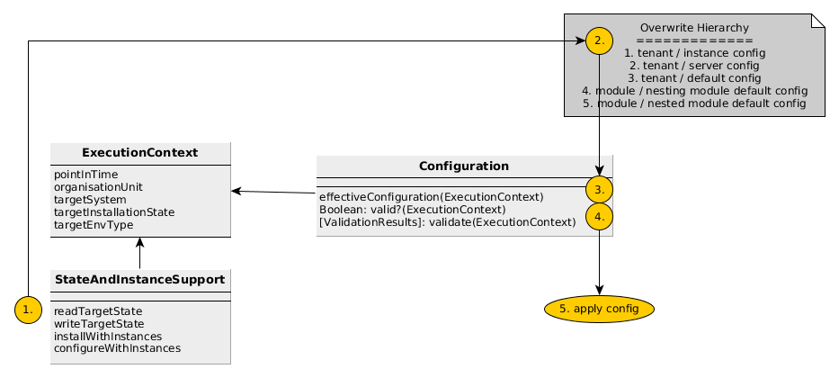

#DDA Core Modules

## Module Description
### ExecutionContext
The ExecutionContext encapsulates the for application of config management recognized state:
* pointInTime - the current world time
* organisationUnit - the organizational execution context. May be tenant or finer grained organizational units. 
* targetSystem - pallet default representation of target system facts like ip, os-type and so on.
* targetInstallationState - additional dda representation of target systems installation state.  
* targetEnvType - additional dda represantation of target environment type like dev, test, integration or production.  
 
### StateAndInstanceSupport
The StateAndInstanceSupport can 
* read/write target systems installation state &
* manage the installation & configuration of server- and instance-leveled config management specifications. 

### Configuration
Configuration can for specific ExecutionContexts
1. provide the effectiveCofiguration and
2. validate.

In addition Configuration resolves the noted overwrite hierarchy. 

## Process
1. __readTargetState__: and fill in the execution context.
2. __resolveOverwrite__ && 
3. __provideEffectiveConfiguration__ for
4. __valid?__
5. and finally __apply the configuration__.
