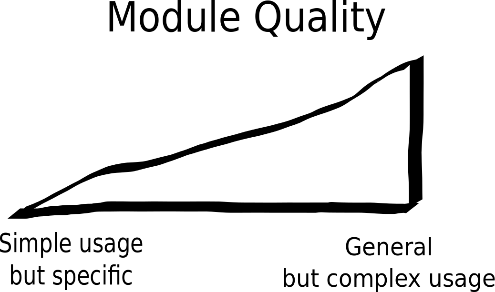
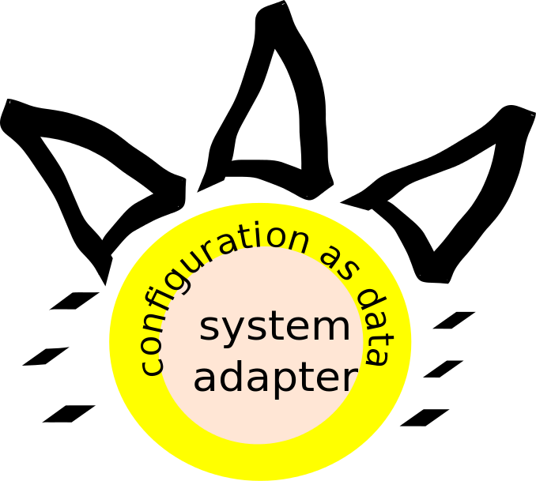

#Business Value of Configuration Management

Maybe it's a simple question but did you ever have thought about "what makes the business value of DevOps"?

There is one obvious answer:
  1. Automation makes installations more repeatable, scalable, faster and increase the quality. Automation drives our world since more than thousand years, and it will continue to be valuable.
  2. But beside this high level answer, there is also an answer with more DevOps insight: "The DevOps BusinessValue depends strongly on the right level of Abstraction between conventions and fully featured system adapters."

## Conventions <-> Fully featured System Adapters

"Chose the right level of Abstraction" allways sounds feasible, but what does this mean? Well take a look to all these DevOps systems out there - puppet, chef, salt or even terraform. I've noticed there are often multiple modules addressing the same service, let's choose the ssh-server-configuration as example. This modules have a wide variance in terms of quality. After trying the one or another module many DevOps users end up in writing their new, own module and adding one more ssh-server-configuration module to the collection.

What's the reason behind that experience? What means "quality" at this point? Well, we define quality as "a module should make all the underlaying configuration options accessible to the DevOps user". In this case we can achieve one common ssh-server-configuration module, and everybody will be able to use and improve this module.

But there will be also a downside. Using this good quality module will be very complex, because ssh-server-configuration has lot of options. This complexity collides with the "convention over configuration" principle.
As a DevOps user I want to put in as less pieces of information as possible. In best case I want order "one production web shop" and get all the webservers, appservers, database servers set up in the right manner. A very complex ssh-server-configuration module will not fit in this scenario.

I think, this abstraction gap is the reason, why we see so many modules addressing the same services. Many DevOps users are trying to implement their conventions directly into their service module. So every DevOps user will end up to have his own ssh-server-configuration module. But he will have to maintain new os-distributions, he will have to implement security and he will be forced to cover more and more options because there will more and more exceptions over time.

In dda-pallet (a DevOps system written in clojure) we found it important, to distinguish between general usable, complex modules (we call them system-adapter-crate crate is the pallet word for module) and convention modules (convention-crate).
So we can implement maintenance, security and quality together with our community on the level of adapter-crates.
On the other hand we handle every configuration on top of these adapter-crates as data. So it is very easy to implement own conventions on top of these adatper-crates.

I think this idea is not solely bound to our DevOps System and would improve the situation also on the systems mentioned above.
