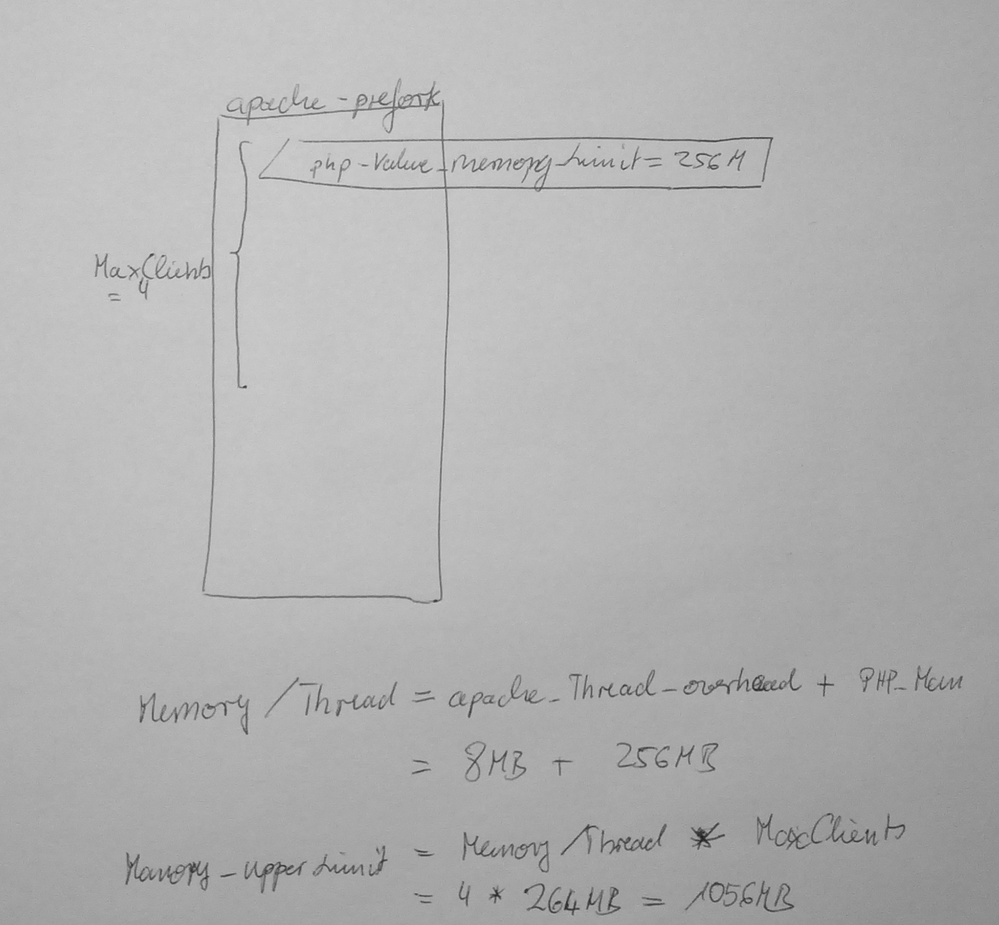

# Analysis

## Migration of Web Applications to an other Server
When migrating a web application to an other server, there are some things to consider:
1. Migration of the DNS will not become effective synchronous. But DNS renaming becomes effective in about one day in most regions of the world.
2. There are two servers with same name from internal point of view.
  1. Configmanagement has to be able to distinguished between these same named servers.
  2. Data and application hast to be migrated - server name aware configuration can stay unchanged.
  3. Browser will reload stuff also name based. so we've to ensure, that only new system is addressed.

## apache driven PHP webapp

 

### Memory / Thread
1. The apache thread itself will take some memory - we measured about 8M per plain thread.
2. The payload php-thread can grow to his configured memory_limit - 256M in our case.

### Max Memory consumption
The overall memory consumption results in memory / thread * MaxClients (4 in our case).

### Articles to read
* http://jessesnet.com/development-notes/2014/apache-prefork-mpm-maxclients/
* https://www.devside.net/articles/apache-performance-tuning
* https://www.thomas-krenn.com/de/wiki/Apache_Performance_Tuning