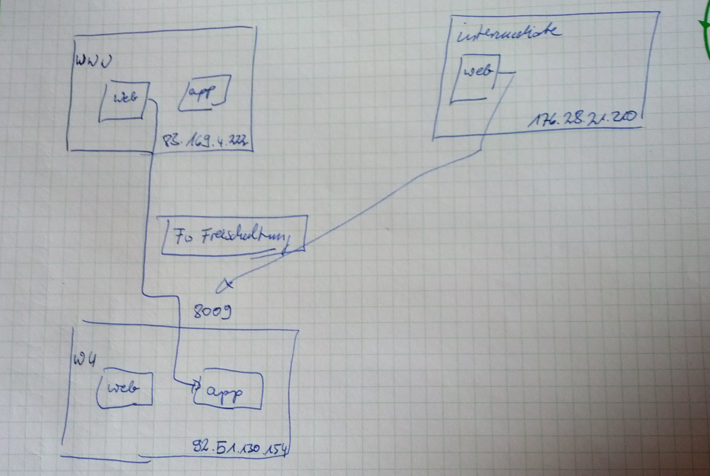

# Migration of Web Applications to an other Server

The Idea is to use in a three tier environment the Web-Servers transparently to forward requests to the new application server.

##Procedure to Migrate an Web Application to an other Server

###Migration upfront Work
1. Enable incoming connections on new application server.
2. Alter servers reverse DNS settings

###On Migration Day
1. Alter servers DNS settings
2. Shutdown old servers application.
3. Backup old servers application data.
4. Restore backup data on new server.
5. Start new server.
6. Bring request forward old_servers_web_server -> new_servers_app_server in place.

###Migration afterward Work
1. Check old server whether there are no more forwarded requests.
2. shutdown old server.
3. close allowed forwards in firewall.
